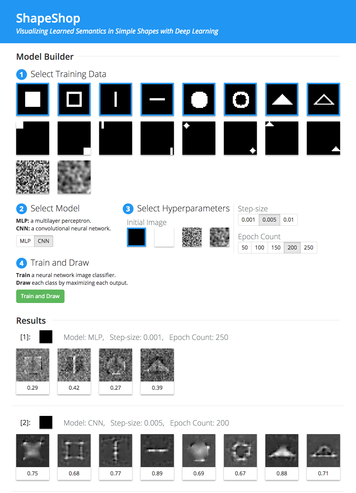

# ShapeShop
*Visualizing Learned Semantics with Deep Learning*

The Shape Workshop (**ShapeShop**) is an interactive system for visualizing and understanding what semantics a neural network model has learned in iamges consisting of simple shapes. It encourages model building, experimentation, and comparison to helps users explore the robustness of image classifiers. 

**ShapeShop: Visualizing Learned Semantics with Deep Learning**  
Fred Hohman, Nathan Hodas, Duen Horng Chau.  
*Workshop on the Future of Interactive Learning Machines at Neural Information Processing Systems (NIPS).* Dec 9, 2016. Barcelona, Spain. *Under review.*



## Requirements 

### Python (2.7)

numpy==1.11.0  
scipy==0.17.0  
Flask==0.11.1  
Keras==1.1.1  
Theano==0.8.2  
matplotlib==1.5.1

For Keras, we use the Theano backend. See [keras.io/backend](https://keras.io/backend/) for how to change backend.

### Javascript
D3 4.0 (loaded via web)  
jQuery 1.12.4 (loaded via web)

## Installation 

Once the requirements have been met, simply download the repository. 

## Usage

### Running ShapeShop

Run the system by 
```bash

python server.py
```
and pointing your browser to `http://localhost:5000`.

### Using ShapeShop

To use ShapeShop, follow the enumerated steps. 

1. **Select Training Data.** Choose what training data you want include. The number of training images chosen corresponding to how many classes the image classifier contains. You must select at least two!
2. **Select Model.** Choose which model you want to use. MLP corresponds to a multilayer perceptron and CNN corresponds to a convolutional neural network.
3. **Select Hyperparameters.** Choose what hyperparameters you want for model training and the image generation process.
4. **Train and Draw.** Click the button to train the model and produce your results!

ShapeShop uses the class activation maximization visualization technique to maximize each class to produce N images, each corresponding to one class. The system then presents all N resulting images and correlation coefficients back to the user for visual inspection and comparison. This process then repeats, where the user can select different images to train on, produce more images from new models, and compare to the previous results.

## License

MIT License. See [`LICENSE.md`](LICENSE.md).

## Credits 

For questions and support contact [Fred Hohman](http://www.fredhohman.com).

**ShapeShop: Visualizing Learned Semantics with Deep Learning**  
Fred Hohman, Nathan Hodas, Duen Horng Chau.  
*Workshop on the Future of Interactive Learning Machines at Neural Information Processing Systems (NIPS).* Dec 9, 2016. Barcelona, Spain. *Under review.*
